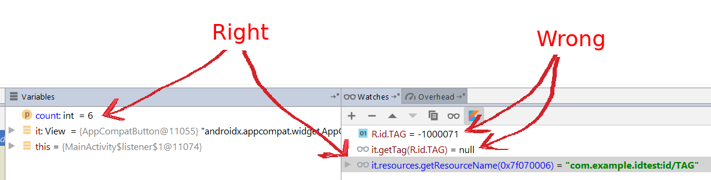

There is a bug in the way Android Studio displays id resource values.

In the debug tool, the watch window shows incorrect values for resources. For example, the id resoure
```
	<item name="TAG" type="id" />
```	
might have a value in the project R file of __0x7f070006__, but the watch window shows it incorrectly as __-1000071__.

If we use this id as a tag idenifier, 
```
    view.addTag(R.id.TAG, 0)
```
Code using the resource works properly:
```
    view.getTag(R.id.TAG) as Int -> 0
```
but in the watch window we get bad values:
```
    R.id.TAG = -1000071
    view.getTag(R.id.TAG) = null
```
This makes it difficult to debug anything using an ID resource.
To reproduce, run this app and set a breakpoint in the listener.


